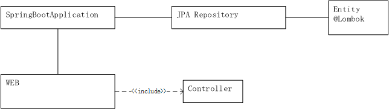

# Spring Tutorials Notes

All notes come from the Spring [official training](https://spring.io/guides). Every training section provides real-world solution to a scenario.

## Training 1. Building REST services with Spring

A brief introduction to *RESTful* Web API

>  In a RESTful Web service, requests made to a resource's URI will elicit a response with a payload formatted in HTML, XML, JSON, or some other format. The response can confirm that some alteration has been made to the stored resource, and the response can provide hypertext links to other related resources or collections of resources. 

So building on top of HTTP, *REST* APIs provide the means to build flexible APIs that can:

* Support backward compatibility

* Evolvable APIs

* Scaleable services

* Securable services

* A spectrum of stateless to stateful services

----

Tools:

* [Lombok](https://projectlombok.org/): A library helps generate all the methods like `getters`, `setters`, `toString`, `hashCode`.

* [H2](https://www.h2database.com/html/main.html): A DBMS implemented in java.

* [JPA](https://en.wikipedia.org/wiki/Java_Persistence_API): API helps make a java `bean` lighweight and suitable for realtional data.

* [Spring HATEOAS](https://en.wikipedia.org/wiki/HATEOAS): *REST* client should then be able to use server-provided links dynamically to discover all the available actions and resources it needs.

Application Architecture:
:

----

1. **SpringBootApplication**

A `@SpringBootApplication` annotation shall be added, which is a meta-annotation that pulls in **component scanning**, **autoconfiguration**, and **property support**.

Besides, 

```java
SpringApplication.run(PayrollApplication.class, args);
```

in the `main` method.

2. **JPA Repository**

*TODO*: 

Learning contents from 
https://docs.spring.io/spring-data/jpa/docs/current/reference/html/#repositories

