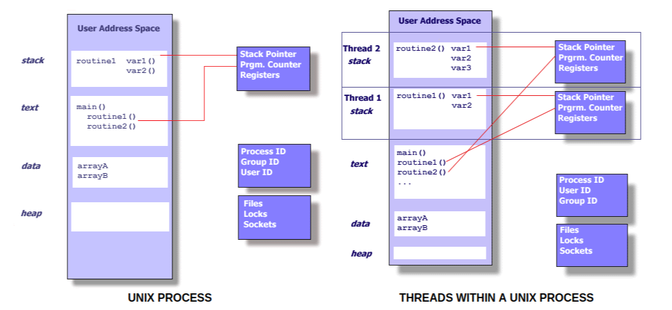

# Linux学习计划

## 通常操作

*  I/O重定向操作

streams       |     重定向符         |   内容
--------      |     ------          |  ----
`stdin`(0)    |   `<`&`<<`          |  设备输入、EOF = __ctrl-d__(终端)
`stdout`(1)   |   `>`&`>>`          |  到terminal(默认)
`stderr`(2)   |   `2>`&`2>>`        |  多配合管道使用

*  管道操作

将一个程序的流重定向到另一个程序，源程序的数据不显示，显示经过第二个程序过滤的输出流，常配合过滤命令使用。

`find`, `grep`, `tee`, `tr`, `wc`等

e.g. 检测80端口的情况
```
netstat -ant | grep :80
```


*  进程管理

常用`ps -ef`, `ps -aux`  具体参数查看`man`手册

*  常用命令

  1. `grep` 通过给定的正则表达式对输入进行匹配
  2. `sort` 对指定的文件进行排序
  3. `sed` stream-editor对文件进行快速的流式__按行__处理
  4. `awk` 用给定的模式串在输入文件中进行匹配


----

## Shell编程

* 变量

赋值`=`两侧 __无__ 空格 __无__`$`，引用时用`$`， 建议附加`{}`（区分变量与字符串边界）

* 特殊符号

类型      |     作用      |  e.g.
  -----      |       ----       |   ----
单引号`' '`         | 保持原样 无法转义          |   ```str='uname'; echo '$str'``` 打印 $str
双引号`" "`       | 可替换变量 允许转义     |   ``` str='uname'; echo "$str"``` 打印 uname
反引号`` ` ` ``  | 交给shell执行 | ``` str='uname'; echo `$str` ``` 打印 Linux
分号`;`  |  用于分隔语法关键字或命令 |  ``` echo "hello"; echo"world" ``` 等价于两行代码换行
单小括号`( )`   | 命令组、命令替换、初始化数组
双小括号`(( ))`  | 整数扩展、重定义变量、代替`$`引用变量
单中括号`[ ]`  |  与`test`等价、数组
双中括号`[[ ]]`  |  关键字，替代`[ ]``
花括号`{ }`  |  代码块，模式匹配替换结构

> 括号 参考https://blog.csdn.net/tttyd/article/details/11742241

* 参数传递

参数处理                  |           说明
 -------                  |         --------
`$#`                      |  传递到脚本的参数个数
`$1` `$2`                 |  第几个参数
`$*` `$@`                 |  显示所有向脚本传递的参数(`$*`为一个单字符串, `$@`为一个array, 在被""作用下产生区别)
`$$`                      |  脚本运行的当前进程ID号
`$-`                      |  显示Shell使用的当前选项
`$?`                      |  显示最后命令的退出状态。0表示没有错误，其他任何值表明有错误。

> 参考[test1](./test1)

* `if`语句

```
if condition
then
    command1
elif condition2
then
    command2
else
    command3
fi
```

`else`分支不可为空

```
if condition; then

fi
```

* `for`语句

```
for var in item1 item2 ... itemN
do
    command1
    command2
    ...
    commandN
done
```

* `while`语句

```
while condition
do
    command
done
```

----

## gcc

* gcc 编译过程


* 重要参数与标志

标志       |     含义         |   e.g.
--------      |     ------          |  ----
`CFLAGS` `CXXFLAGS`   |   编译器（`CC`）FLAGS; 环境变量 或 Makefile变量; 指定编译器的额外开关（优化，调试）    |   `-g`, `-O2`, `-Wall`, `-I/usr/local/include`
`LDFLAGS`   |   链接器（`ld`）FLAGS; 一般为autoconf指定于./configure;           |  `-L/usr/local/bin`
`-L` `-l`   |   __链接__ `-L`为`-l`指定额外的库文件夹; `-l`指定库文件,名称需包含"library"       |  静态库文件"libxxx.a" 被指定为 `-lxxx`（去掉前缀"lib"和扩展名".a"）
`LIBRARY_PATH`  | 环境变量; 指定 __动态库__ 的位置　用于__链接__过程中寻找__静态__库文件; 在链接过程中的`-L<dir>`后搜索  |
`LD_LIBRARY_PATH`  | 环境变量; 指定 __动态加载库__ 的位置 用于__程序__寻找__共享__库文件（作用于运行时）  |

* 各类库文件

    1. 静态库(".a")

        1. 编译object文件。例如：cc -Wall -c ctest1.c ctest2.c
        2. 创建库文件。例如：ar -cvq libctest.a ctest1.o ctest2.o
        3. 可以通过ar -t查看.a文件中包含哪些.o
        4. 构建符号表。ranlib libctest.a用于为.a创建符号表

    2. 动态库(".so")

        1. 编译object文件时使用-fPIC选项:
        ```
        gcc -Wall -fPIC -c *.c
        ```
        这个选项的目的是让编译器生成地址无关(position independent)的代码，这是因为，动态库是在运行期间链接的，变量和函数的偏移量是事先不知道的，需要链接以后根据offset进行地址重定向。

        或者

        2. 使用`-shared`链接:
        ```
        gcc -shared -Wl,-soname,libctest.so.1 -o libctest.so.1.0 *.o
        ```
        -shared选项是让动态库得以在运行期间被动态链接;-Wl,options是设置传递给ld(链接器)的参数，在上面的例子中，当链接器在链接.o时会执行ld -soname ibctest.so.1

        或者

        3. 创建软链:
        上面的命令将最终输出一个动态库libctest.so.1.0，而出于习惯，会创建两个软链:
        ```
        mv libctest.so.1.0 /opt/lib
        ln -sf /opt/lib/libctest.so.1.0 /opt/lib/libctest.so.1
        ln -sf /opt/lib/libctest.so.1.0 /opt/lib/libctest.so
        ```

        libctest.so用于在编译期间使用-lctest让编译器找到动态库，而libctest.so.1用于在运行期间链接

        `gcc -Wall -I/path/to/include-files -L/path/to/libraries prog.c -lctest -o prog`

>　参考http://www.techug.com/post/linux-static-lib-dynamic-lib.html

*  ELF文件概念

ELF(Exutable and Linkable Format)文件代表了可执行文件、目标代码(.o)、共享库文件和转储文件(core dumps)。在设计上，ELF文件是 __跨平台__ 的，不限制于和任何CPU与指令集。

----

## Makefile

* 规则

```
target: dependencies
    system command(s)
```

target: 通常为程序生成的可执行文件或.o文件，同样也可为所需执行的命令，如`clean`
dependencies(prerequisite): 作为生成target的输入文件 可以有 __零__ 个或多个
system commands(recipe): 所需要执行的操作. 格式遵从 __off-side rule__ 即缩进由 __\tab__ 字符表示

执行时调用`make`命令,自动搜索名称为"makefile"或"Makefile"的文件,指定自定义文件参数为`-f`

>  参考[test2](./test2/) 

>  其中myMakeFile采用了[suffix rule](https://www.gnu.org/software/make/manual/html_node/Suffix-Rules.html)

----

## pthread多线程编程

*  进程(process) v.s. 线程(thread)

进程包含信息:

* Process ID, process group ID, user ID, and group ID
* Environment
* Working directory
* Program instructions
* Registers
* Stack
* Heap
* File descriptors
* Signal actions
* Shared libraries
* Inter-process communication tools (such as message queues, pipes, semaphores, or shared memory). 

线程包含信息:

* Stack pointer
* Registers
* Scheduling properties (such as policy or priority)
* Set of pending and blocked signals
* Thread specific data.



通常将pthread API分为四类:(以`pthread_`为前缀)

名称				|		作用
----				|		----
Thread management	|	线程的直接操作creating,detaching,joining;并包含设置、查询线程属性函数
Mutexes				|	处理**同步**，提供创建、销毁、加锁、解锁功能
Condition variables	|	负责落实共享`mutex`的线程间进行通信
Synchronization		|	负责管理读/写锁和同步屏障

> 并行编程中`join`和`barrier`的区别

> `join`后，总体变为**串行**，即只有一个线程在运行;

> `barrier`后，仅仅是所有线程在此同步，之后继续保持**并行**.
