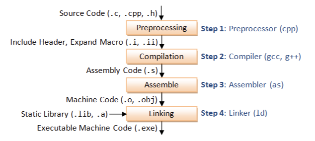

# Linux学习计划

## 通常操作

*  I/O重定向操作

streams       |     重定向符         |   内容
--------      |     ------          |  ----
`stdin`(0)    |   `<`&`<<`          |  设备输入、EOF = __ctrl-d__(终端)
`stdout`(1)   |   `>`&`>>`          |  到terminal(默认)
`stderr`(2)   |   `2>`&`2>>`        |  多配合管道使用

*  管道操作

将一个程序的流重定向到另一个程序，源程序的数据不显示，显示经过第二个程序过滤的输出流，常配合过滤命令使用。

`find`, `grep`, `tee`, `tr`, `wc`等

e.g. 检测80端口的情况
```
netstat -ant | grep :80
```


*  进程管理

常用`ps -ef`, `ps -aux`  具体参数查看`man`手册

*  常用命令

  1. `grep` 通过给定的正则表达式对输入进行匹配
  2. `sort` 对指定的文件进行排序
  3. `sed` stream-editor对文件进行快速的流式__按行__处理
  4. `awk` 用给定的模式串在输入文件中进行匹配


----

## Shell编程

* 变量

赋值`=`两侧__无__空格 __无__`$`，引用时用`$`， 建议附加`{}`（区分变量与字符串边界）

* 特殊符号

类型      |     作用      |  e.g.
  -----      |       ----       |   ----
单引号`' '`         | 保持原样 无法转义          |   ```str='uname'; echo '$str'``` 打印 $str
双引号`" "`       | 可替换变量 允许转义     |   ``` str='uname'; echo "$str"``` 打印 uname
反引号`` ` ` ``  | 交给shell执行 | ``` str='uname'; echo `$str` ``` 打印 Linux
分号`;`  |  用于分隔语法关键字或命令 |  ``` echo "hello"; echo"world" ``` 等价于两行代码换行
单小括号`( )`   | 命令组、命令替换、初始化数组
双小括号`(( ))`  | 整数扩展、重定义变量、代替`$`引用变量
单中括号`[ ]`  |  与`test`等价、数组
双中括号`[[ ]]`  |  关键字，替代`[ ]``
花括号`{ }`  |  代码块，模式匹配替换结构

> 括号 参考https://blog.csdn.net/tttyd/article/details/11742241

* 参数传递

参数处理          |           说明
    ----                  |         ----
  `$#`                |   传递到脚本的参数个数
`$1` `$2`        |  第几个参数
`$*` `$@`       |  以一个单字符串显示所有向脚本传递的参数。
`$$`                  |  脚本运行的当前进程ID号
`$-`                  |  显示Shell使用的当前选项
`$?`                  |  显示最后命令的退出状态。0表示没有错误，其他任何值表明有错误。

* `if`语句

```
if condition
then
    command1
elif condition2
then
    command2
else
    command3
fi
```

`else`分支不可为空

```
if condition; then

fi
```

* `for`语句

```
for var in item1 item2 ... itemN
do
    command1
    command2
    ...
    commandN
done
```

* `while`语句

```
while condition
do
    command
done
```

## gcc

* gcc 编译过程



标志       |     含义         |   e.g.
--------      |     ------          |  ----
`CFLAGS` `CXXFLAGS`   |   编译器（`CC`）FLAGS; 环境变量 或 Makefile变量; 指定编译器的额外开关（优化，调试）    |   `-g`, `-O2`, `-Wall`, `-I/usr/local/include`
`LDFLAGS`   |   链接器（`ld`）FLAGS; 一般为autoconf指定于./configure;           |  `-L/usr/local/bin`
`-L` `-l`   |   __链接__ `-L`为`-l`指定额外的库文件夹; `-l`指定库文件,名称需包含"library"       |  静态库文件"libxxx.a" 被指定为 `-lxxx`（去掉前缀"lib"和扩展名".a"）
`LIBRARY_PATH`  | 环境变量; 用于__链接__过程中寻找__静态__库文件; 在链接过程中的`-L<dir>`后搜索  |
`LD_LIBRARY_PATH`  | 环境变量; 用于__程序__寻找__共享__库文件（作用于运行时）  |
