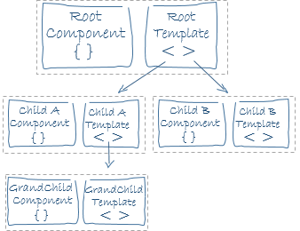

# Angular


----


# Chapter 1. FUNDAMENTALS

## Section1. Architecture Overview

Angular is a platform and framework for building client applications in HTML and TypeScript.


## Section 2. Intro to Modules

NgModules are containers for a cohesive block of code dedicated to an application domain, a workflow, or a closely related set of capabilities.

The module in Angular has a prefix 'Ng'(To distinguish it from JS module).

An NgModule is defined by a class decorated with `@NgModule()`. 

### NgModule metadata(important properties):

* `declarations`: The components, directives, and pipes that belong to this NgModule.

* `exports`: The subset of declarations that should be visible and usable in the component templates of other NgModules.

* `imports`: Other modules whose exported classes are needed by component templates declared in this NgModule.

* `providers`: Creators of services that this NgModule contributes to the global collection of services; they become accessible in all parts of the app. (You can also specify providers at the component level, which is often preferred.)

* `bootstrap`: The main application view, called the root component, which hosts all other app views. Only the root NgModule should set the bootstrap property.

### Angular Libraries v.s. Javascript modules
```typescript
import { Component } from '@angular/core';
```
The `import` statements imports Angular libraries.

```typescript
imports:      [ BrowserModule ],
```
Javascript imports modules by using `@NgModule` metadata `imports`.

## Section 3. Intro to Components

A component controls a patch of screen called a *view*.

The `@Component` decorator identifies the class immediately below it as a component class, and specifies its metadata.

### Component metadata
* `selector`: A CSS selector that tells Angular to create and insert an instance of this component wherever it finds the corresponding tag in template HTML. 

* `templateUrl`: The module-relative address of this component's HTML template. Alternatively, you can provide the HTML template inline, as the value of the template property. This template defines the component's host view.

* `providers`: An array of `providers` for services that the component requires.

### Templates and views

Views are typically arranged hierarchically, allowing you to modify or show and hide entire UI sections or pages as a unit. 



### [Template Syntax](TODO)

#### Data binding:
Normally there are four ways of data binding:


* One-way:
    1. Interpolation
    2. Property binding
    3. Event binding

* 4. Two-way databinding

#### Directives:
* Structural directives

```html
<li *ngFor="let hero of heroes"></li>
```

* Attribute directives
```html
<input [(ngModel)]="hero.name">
```

## Section 3. Intro to Components


Service is a broad category encompassing any value, function, or feature that an app needs. A service is typically a class with a narrow, well-defined purpose. It should do something specific and do it well.

### Dependency Injection

To define a class as a service in Angular, use `@Injectable()` decorator.

**Injector**: Angular provides

**Provider**: Object that tells an injector how to obtain or create a dependency.

Services or any dependencies that a component is about to use shall be included in the *constructor parameters*.

A service instance's existence is first checked globally before a new one created.


You must register at least one provider of any service you are going to use. There're several ways to register providers:

* By default, the Angular CLI command `ng generate service` registers a provider with the root injector for your service by including provider metadata in the `@Injectable()` decorator.

```typescript
@Injectable({
 providedIn: 'root',
})
```

    When you provide the service at the root level, Angular creates **a single, shared instance** of that service and injects it into any class that asks for it.

* When you register a provider with a specific NgModule, **the same instance of a service** is available to all components in that NgModule.

```ts
@NgModule({
  providers: [
  BackendService,
  Logger
 ],
 ...
})
```

* When you register a provider at the component level, you get **a new instance of the service** with each new instance of that component.

```ts
@Component({
  selector:    'app-hero-list',
  templateUrl: './hero-list.component.html',
  providers:  [ HeroService ]
})
```

# Chapter 3. Routing & Navigation

## Section 1. Routing basics

Routing module shall be imported after the Model modules which are supposed to be used by the Routing modules.

`Routes` parameters hints:

* `path`:

* `redirectTo`:

* `component`:

* `pathMatch`: Technically, `pathMatch = 'full' ` results in a route hit when the remaining, unmatched segments of the URL match `''`. 

> The order of route configuration matters. The router accepts the first route that matches a navigation request path. Thus, a wildcard path shall be put as the last item to match all the um-matched conditions.

----

`RouterModule.forRoot()`&`RouterModule.forChild()` receives two possible parameters:

* `Routes`: As described above.

* `{enableTracing: true/false}`: To toggle the trace in the DEBUG mode.

## Section 3. Route definination with a parameter

For instance, inside of a `Routes` configuration:

```ts
{ path: 'hero/:id', component: HeroDetailComponent }
```

the `:id` reserves a slot as a *Route Parameter*.

To retrieve the route's parameter, two additional module shall be imported:

```ts
import { Router, ActivatedRoute, ParamMap } from '@angular/router';
```

## Section 4. ParamMap

## Section 5. Child Routing
Child routing's core concept is to maintain the other modules intact while navigate relative to some child module.


The ideas are: 

* Each feature area resides in its own folder.
* Each feature has its own Angular feature module.
* Each area has its own area root component.
* Each area root component has its own router outlet and child routes.
* Feature area routes rarely (if ever) cross with routes of other features.

---- 

At the top level, paths that begin with `/` refer to the root of the application. But child routes extend the path of the parent route. With each step down the route tree, you add a slash followed by the route path, unless the path is empty.

> The child module shall be imported before its parent level routing module is imported.

### 5.1 Relative navigation

The router matches absolute paths(starts with a `/`) to routes starting from the top of the route configuration.

The router supports directory-like syntax in a link parameters list to help guide route name lookup:

* `./` or no leading slash is relative to the current level.

* `../` to go up one level in the route path.

You can combine relative navigation syntax with an ancestor path. If you must navigate to a sibling route, you could use the `../<sibling>` convention to go up one level, then over and down the sibling route path.

To navigate a relative path with the `Router.navigate` method, you must supply the `ActivatedRoute` to give the router knowledge of where you are in the current route tree.

After the link parameters array, add an object with a `relativeTo` property set to the `ActivatedRoute`. The router then calculates the target URL based on the active route's location.

> Always specify the complete absolute path when calling router's `navigateByUrl` method.

> When using a `RouterLink` to navigate instead of the Router service, you'd use the same link parameters array, but you **wouldn't** provide the object with the relativeTo property. The `ActivatedRoute` is implicit in a `RouterLink` directive.

```ts
// Relative navigation back to the crises
this.router.navigate(['../', { id: crisisId, foo: 'foo' }], { relativeTo: this.route });
```

### 5.2 Displaying multiple routes in named outlets

The router only supports one primary *unnamed* outlet per template.

A template can also have any number of *named* outlets. Each named outlet has its own set of routes with their own components. Multiple outlets can be displaying different content, determined by different routes, all at the same time.

Named outlets are the targets of *secondary routes*.

**Secondary routes**'s key respects:

* They are independent of each other.
* They work in combination with other routes.
* They are displayed in named outlets.


## Section ?. Lazy-loading module

A module could be lazy loaded by configuring `loadChildren` properties in `Route`.